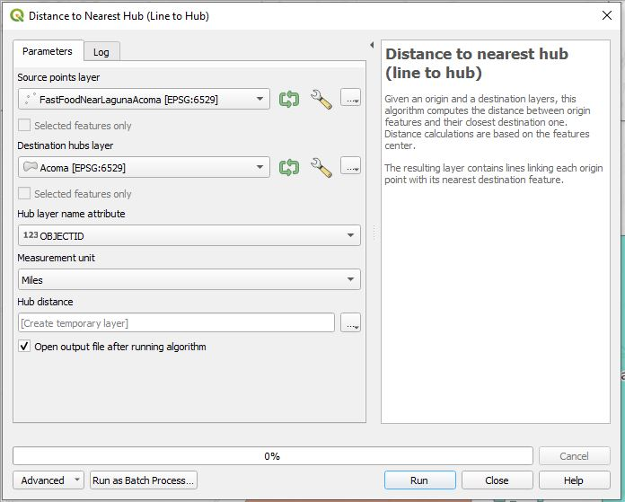

# Food Access Near Acoma & Laguna Pueblos

Food deserts are defined as "areas where people have limited access to a variety of healthy and affordable food." [(USDA, 2012)](https://www.ers.usda.gov/webdocs/publications/45014/30940_err140.pdf) This map, available [here](Images/Map/FoodAccess_LagunaAcoma_1200px.png), will serve as a quick glimpse at what a food desert might look like in an underserved area, like my home reservations in New Mexico—Acoma and Laguna Pueblos. 

## Project Contents
- [Data Source](#data-source)
- [Project Background](#project-background)
- [Mapmaking Process](#mapmaking-process)
- [Map Summary & Map](#map-summary)
- [Final Project Link](#final-project-link)

***

### Data Source

- [Data.gov](https://catalog.data.gov/dataset/tiger-line-shapefile-2020-nation-u-s-american-indian-tribal-subdivisions) for U.S. tribal regions shapefile
- [U.S. Census Bureau TIGER Products](https://www.census.gov/geographies/mapping-files/time-series/geo/cartographic-boundary.html) for county & state shapefiles
- [OpenStreetMap](http://openstreetmap.org) (QuickOSM feature in QGIS) for restaurant & grocery store location data
- Initial Data projection: WGS 84, EPSG:4326
- Final Map projection: NAD83(2011)/New Mexico Central (ftUS), EPSG:6529

***

### Project Background

Historically, underprivileged or marginalized communities have been subject to environmental injustices like the food desert. Comparing communities or census tracts against varying factors like affluency, education, employment rates, race, and environment might provide some insight into solutions for these issues. Communities like displaced Indigenous peoples on reservations, as just one example, are subject to this type of injustice.

***

### Purpose

I want to bring attention to environmental injustices, especially for my people. The purpose of this project is to provide a quick snapshot of what a food desert might look like on a map. Hopefully, this map might stir a conversation. Of course, I chose my own tribal affiliations, Acoma and Laguna Pueblos. These pueblos are sister tribes and often referred to as Laguna-Acoma. They are impoverished communities located in the southwestern New Mexican desert.

***

### Mapmaking Process

1. In QGIS, set Coordinate Reference System to *NAD83(2011)/New Mexico Central (ftUS), EPSG:6529*.
    - **Project** menu > **Properties** > **CRS** 

2. Download county, state, and tribal [shapefiles](#data-source). Add these files to **Layers** pane.
    - Filter layers to area of interest as appropriate. In this case, I filtered to New Mexico, Laguna-Acoma Pueblos, then the counties surrounding Laguna-Acoma.

3. Save each layer as a GeoJSON.
    - Right-click a layer, choose **Export**, then *Save Feature As...*
    - Name the file and choose an appropriate folder destination
    - Change format to **GeoJSON** and the **CRS** to *NAD83(2011)/New Mexico Central (ftUS), EPSG:6529*
    - Remove previously filtered layer from **Layers** pane
    - Repeat for each layer

4. Choose the **QuickOSM** button to perform separate queries for supermarkets and fast food.
    - Make sure the map is already zoomed in to the area of interest, then have the query run for the **Canvas Extent**

    
    - **Run query**
    - Each query will appear in the **Layers** pane as a temporary layer. Save each as a GeoJSON with the appropriate CRS
    - Remove previously used query layers from **Layers** pane

5. Calculate distances from the tribal polygons to the restaurants & fast food points.
    - **Processing** menu > **Toolbox** > **Distance to nearest hub (line to hub)**
    - Choose the new fast food GeoJSON as the *Source points layer*
    - Choose a tribal polygon GeoJSON as the *Destination hubs layer*
    - The *Hub layer name attribute* should be a field that is unique for every object. If unsure which field that is, check the attribute table from the **Layers** pane
    - Choose appropriate *Measurement unit*. I chose miles.

    
    - Under *Hub Distance*, choose an appropriate name & destination for the new file
    - Repeat this process for the other tribal region, and twice more with the supermarket dataset

6. Using the **Measure Line** button, I can see there are no supermarkets within 20 miles from either reservation, but I can see a handful of fast food places within that distance. Let's filter the new line layers so we can better illustrate our point.
    - For the fast food layers, filter *"HubDist" <= '20'*
    - For the supermarket layers, filter *"HubDist <= '50'*

7. Adjust symbology & labels as appropriate.

***

### Map summary

We can now visualize which fast food places are within 20 miles of Laguna-Acoma. We can also see the nearest supermarkets are much farther than the fast food locations are, at least 20 miles away. Perhaps eating fast food is more convenient than shopping at the supermarket. How might this affect the overall health of this Indigenous communities? We can tell that most of the supermarket locations are in the big city, Albuquerque (Bernalillo County). 

***

## Final Project Link

Please view the [final map online](https://masonabishop.github.io/Map671FinalProject/)